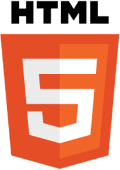
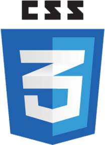

# Women Who Code Manila HTML and CSS Study Group

 

**HTML (HyperText Markup Language)** is the most basic building block of the Web. It describes and defines the 
content of a webpage along with the basic layout of the webpage.

*HTML5 is the latest evolution of the standard that defines HTML. The term represents two different concepts. 
It is a new version of the language HTML, with new elements, attributes, and behaviors, and a larger set of technologies 
that allows the building of more diverse and powerful Web sites and applications.*

**Cascading Style Sheets (CSS)** is a stylesheet language used to describe the presentation 
of a document written in HTML or XML (including XML dialects such as SVG or XHTML). CSS describes how elements should 
be rendered on screen, on paper, in speech, or on other media.

Source: (https://developer.mozilla.org/en-US/docs/Web/Guide/) 

## About this study group

!> Read this [document](wwcodemanila/study_groups.md) first to know what study groups are.

This study group is held once a month and is led by our volunteer leaders. However, everyone is welcome to join, learn, and share their knowledge in the community.

Everyone joining this study group and other Women Who Code events must follow our [code of conduct](https://github.com/WomenWhoCode/guidelines-resources/blob/master/code_of_conduct.md).

<!--
  UPDATE THIS:

  You can add other information about how your study group here.

  DO NOT remove the lines above (under "About this study group") as they are important reminders about study groups
-->

## Relevant links

<!--
  UPDATE THIS:

  Change Gitter and Github links to the ones corresponding to your study groups
-->
- [Gitter Chat](https://gitter.im/WWCodeManila/HTML-CSS): Interact with the community. You can share something about Ruby, or ask help if you're stuck on a problem.
- [Github](https://github.com/wwcodemanila/WWCodeManila-HTML.CSS): View study group code
- [Meetup](https://meetup.com/Women-Who-Code-Manila): Get updated with the upcoming study group and other event schedules.
- [Facebook](https://facebook.com/wwcodemanila): Get updated about what's happening with the community.
- [Twitter](https://twitter.com/wwcodemanila): Get updates about current and future events.
- [Git Page](https://wwcodemanila.github.io/WWCodeManila-HTML.CSS/): This documentation is best viewed here.  

## Helping out

### Volunteer

Attend one of our [events](https://bit.ly/wwcodemanilameetups) and talk to us! :smile:

### Donate

Even a little amount is a big help for us to achieve our mission of inspiring women to excel in tech careers. :heart:

You can donate at our [Open Collective](https://opencollective.com/wwcodemanila).

### Hosting

Do you want to host one of our study groups? Email us at **manila@womenwhocode.com**.

## Contributors

- Marie Antoinette Go ([@switmac](https://github.com/switmac))
- Azel Tan ([@azelalynetan](https://github.com/azelalynetan))
- Ji-Anne Jose ([@jiannejose](https://github.com/jiannejose))
