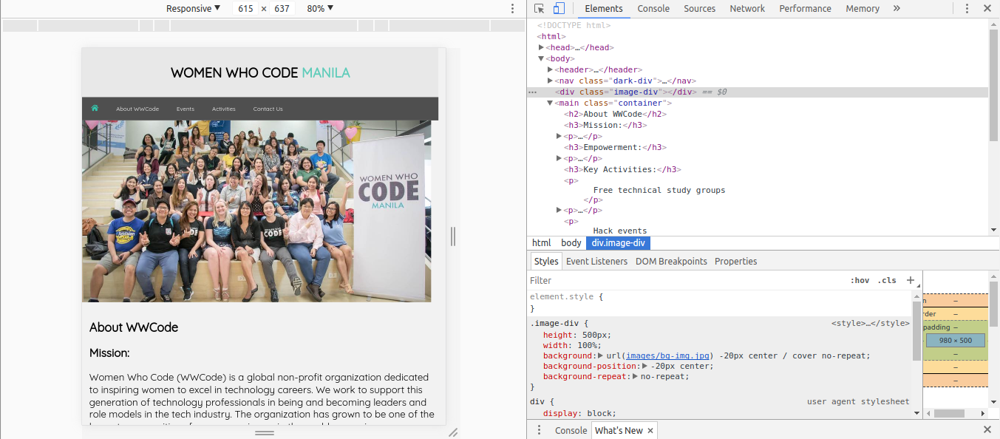

## Responsive Web Design

Responsive Web Design is the ability of a website to deliver effective contents for different screen sizes and devices.

### Viewport
> The viewport is the user's visible area of a web page.

https://www.w3schools.com/css/css_rwd_viewport.asp

### CSS Media Queries
> Media Queries in CSS files plays a great role in making you site responsive. It controls which styles to use for different screen sizes.

Sample Usage in your CSS file add :   
`@media only screen and (max-width: 500px) {
    body {
        background-color: lightblue;
    }
}` 

Try adding this in your css and resize your browser to see the difference;

https://www.w3schools.com/css/css3_mediaqueries.asp 
http://learnlayout.com/media-queries.html    
https://developers.google.com/web/tools/chrome-devtools/device-mode/emulate-mobile-viewports#media-queries   

### Responsive Concepts
https://www.w3schools.com/css/css_rwd_intro.asp   
https://www.udacity.com/course/responsive-web-design-fundamentals--ud893   
https://developers.google.com/web/fundamentals/design-and-ui/responsive/    

### Tutorials   
https://www.udacity.com/course/responsive-web-design-fundamentals--ud893   

### Exercises : Be Responsive
1. In the workspace directory, make index.html responsive. Make sure contents are not overflowing.

2. To test that you site is responsive, resize your browser and see if the contents adjust to fit the browser size.

3. To simulate responsive view for different devices, use the web development tool that's built in the you browsers.   
Press `ctrl+shift+i` for Google Chrome and Mozilla Firefox.   

